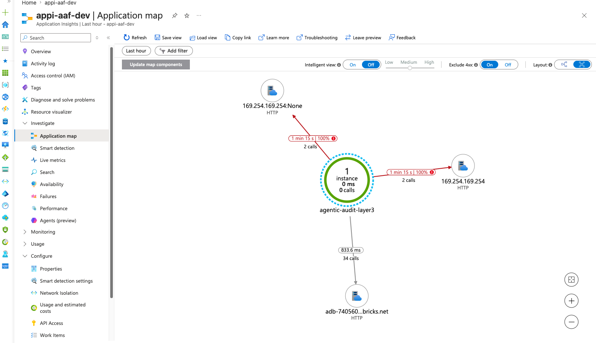
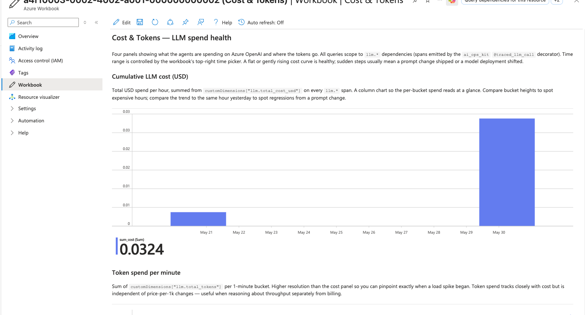
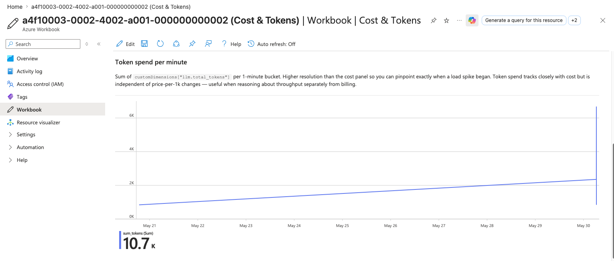
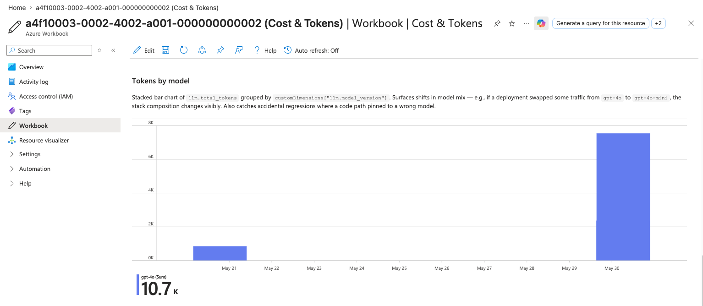

# agentic-audit-framework

Multi-agent SOX control testing on Azure + Databricks. A LangGraph supervisor orchestrates deterministic extraction, grounded narrative generation, and agentic exception investigation — with production-grade observability (OpenTelemetry → Azure Monitor), Unity Catalog governance, and Terraform IaC.

## Status

| | |
|---|---|
| CI | [](https://github.com/rbpal/agentic-audit-framework/actions/workflows/ci.yml) |
| Python | 3.11 · Poetry 2.3+ |
| Tests | 780+ fast unit tests |
| License | MIT |

## Architecture

Three layers, supervised by a LangGraph orchestrator:

- **Layer 1 — Extraction**: deterministic parsing of SOX control Excel workbooks into typed evidence records (silver layer).
- **Layer 2 — Narrative**: grounded control summaries with per-claim fact checking against source evidence. Calibrated to a 27/27 baseline.
- **Layer 3 — Investigation**: a LangGraph supervisor runs extraction → validation → narrative sub-agents to investigate control exceptions, writing decisions and cost telemetry to gold Delta tables.

## Observability

Every LLM call emits an OpenTelemetry span (`llm.*`) carrying token and cost dimensions, shipped to Azure Application Insights via a shared `ai_ops_kit`. Azure Workbooks turn those spans into live cost and agent-health dashboards.

### Application Map



*One Layer-3 investigation rendered as a service topology. The `agentic-audit-layer3` process fans out to the Databricks SQL warehouse (34 healthy calls — silver reads plus gold-table writes) and to the Azure metadata endpoint (`169.254.169.254`). The red IMDS edges are expected when running off-Azure: the managed-identity probe times out and the credential chain falls back to the Azure CLI login, so the run still succeeds.*

### Cumulative LLM cost



*Total USD spend per run, summed from `llm.total_cost_usd` on every `llm.*` span. The tall May-30 bar is a single investigation whose extraction agent now emits per-call spans on top of the narrative span — a flat or gently rising curve is healthy; a sudden step usually means a prompt change shipped or a model deployment shifted.*

### Token spend per minute



*The same spend viewed as `llm.total_tokens` per one-minute bucket. Higher time resolution than the cost panel, so a load spike can be pinpointed to the exact minute it began — useful for reasoning about throughput independently of price-per-1K changes.*

### Tokens by model



*Tokens grouped by `llm.model_version`. A single `gpt-4o` stack confirms the whole pipeline runs on one model; this is the panel that would visibly catch model-mix regressions — e.g. one agent reverting to `gpt-4o-mini` after a refactor.*

## Quickstart

```bash
git clone https://github.com/rbpal/agentic-audit-framework.git
cd agentic-audit-framework
cp .env.example .env    # then fill in Azure OpenAI credentials
make setup              # installs deps + pre-commit hooks
make ci                 # lint + type + test — must exit 0
```

## Make targets

```
help      Show this help
setup     Install Poetry deps and pre-commit hooks (first-time bootstrap)
test      Run pytest with coverage
lint      Run ruff linter + formatter check
type      Run mypy on src/
ci        Run everything CI runs (lint + type + test)
clean     Remove .venv, caches, coverage artifacts
```

## Roadmap

| Phase | Scope | Status |
|---|---|---|
| Layer 1 | Excel control extraction → Delta | ✅ |
| Unity Catalog | lineage + governance | ✅ |
| Layer 2 | grounded narrative + fact checking | ✅ |
| Eval harness | gold scenarios, Wilson-CI scoring | ✅ |
| Layer 3 | agentic exception investigation | ✅ |
| Infra | Terraform IaC (Azure + Databricks) | ✅ |
| Observability | OpenTelemetry → Azure Monitor + Workbooks | ✅ |
| Next | alerting, Streamlit demo, deployment | 🚧 |

## License

MIT. See [LICENSE](LICENSE).
